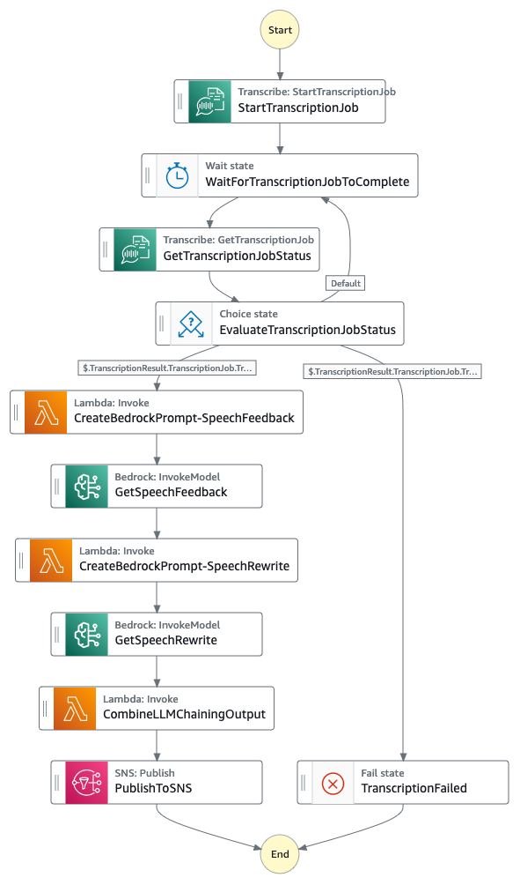

# public-speaking-mentor-ai-assistant

You can find the related blogpost to this repository here: _TODO (add hyperlink when blog is published)_

> [!WARNING]
>**_This example is for experimental purposes only and is not production ready. The deployment of this sample **can incur costs**. Please ensure to remove infrastructure via the provided instructions at the end when not needed anymore._**

## Improve Public Speaking Skills Using a GenAI Based Virtual Assistant With Amazon Bedrock
Public speaking is a critical skill in today's world, whether it's for professional presentations, academic settings, or personal growth. However, many individuals struggle with anxiety, lack of confidence, and ineffective communication during public speaking engagements. Hiring a public speaking coach is expensive and limited in availability. Now, with the advent of Large Language Models (LLMs), a Generative AI-powered virtual assistant can be used by individuals from diverse backgrounds and locations as well as organizations of any size to benefit from real-time analysis of speech, identification of areas for improvement, and suggestions for enhancing the speech delivery.

In this repo, we present an [Amazon Bedrock](https://aws.amazon.com/bedrock/) powered virtual assistant that can transcribe one’s audio in the presentation speech, examine it for language use, grammatical errors, filler words, repetition of words and sentences etc and provide recommendations as well as suggest a curated version of user’s speech to better the presentation. This solution helps refine communication skills, boost confidence, and ultimately empower individuals to become more effective and impactful public speakers. Organizations across various sectors, including corporations, educational institutions, government entities, and social media personalities, can leverage this solution to provide automated coaching for their employees, students, and public speaking engagements.

This solution is written in python only, and uses CDK template to deploy the required infrastructure on AWS.

## Overview of Solution

The solution consists of 4 main components:

* [Amazon Cognito User Pool](https://docs.aws.amazon.com/cognito/latest/developerguide/cognito-user-identity-pools.html) for user authentication - authenticated users are granted access to Public Speaking Mentor AI Assistant web portal to upload audio/video recordings
* A simple web portal created using [Streamlit](https://streamlit.io/) to upload audio/video recordings - the uploaded files are stored in an [Amazon Simple Storage Service](http://aws.amazon.com/s3) (Amazon S3) bucket for later processing, retrieval, and analysis.
* An [AWS Step Functions](https://aws.amazon.com/step-functions/) workflow to orchestrate converting the audio to text using [Amazon Transcribe](https://aws.amazon.com/transcribe/) and then invoking Amazon Bedrock with AI prompt-chaining  to generate speech recommendations and rewrite suggestions.
* [Amazon Simple Notification Service](https://aws.amazon.com/sns/) (Amazon SNS) to send an email notification to the user with Amazon Bedrock generated recommendations.

This solution leverages Amazon Transcribe for speech-to-text conversion through automatic speech recognition. When the user uploads an audio or video file, Amazon Transcribe transcribes the speech into text, which is then passed as input data to the [Anthropic Claude 3.5 Sonnet](https://aws.amazon.com/blogs/aws/anthropics-claude-3-5-sonnet-model-now-available-in-amazon-bedrock-the-most-intelligent-claude-model-yet/) model hosted on Amazon Bedrock. The solution sends two prompts to Amazon Bedrock along with the transcribed text. The first prompt is for generating feedback and recommendations on language usage, grammatical errors, filler words, word and sentence repetition, and other aspects of the speech. The second prompt is for obtaining a curated version of the user's original speech. AI prompt-chaining is performed with Amazon Bedrock for these two prompts to deliver a highly-curated response. Ultimately, the solution consolidates the outputs from both the prompts, displays the comprehensive recommendations derived using Amazon Bedrock on user's web page as well as emails the user with the results. Currently, this solution supports user speech in the english language only. 

## Architecture
The following diagram shows our solution architecture.

Let’s explore the architecture step by step:

1. The user authenticates to Public Speaking Mentor AI Assistant web portal (a Streamlit application hosted on user’s local desktop) utilizing the Amazon Cognito User Pool authentication mechanism.
2. The user uploads an audio/video file to the web portal, which is stored in an encrypted Amazon S3 bucket.
3. The S3 service triggers an s3:ObjectCreated event for each file that is saved to the bucket.
4. Amazon EventBridge invokes the AWS Step Functions workflow based on this event.
5. The AWS Step Functions workflow utilizes AWS SDK integrations to invoke Amazon Transcribe and initiates a StartTranscriptionJob, passing the S3 bucket, prefix path, and object name in the MediaFileUri parameter. The workflow waits for the transcription job to complete and saves the transcript in another S3 bucket prefix path.
6. The AWS Step Functions workflow then utilizes the optimized integrations to invoke Amazon Bedrock's InvokeModel API, which specifies the Anthropic Claude 3.5 Sonnet model, the system prompt, max tokens, and the transcribed speech text as inputs to the API. The system prompt instructs Claude to provide suggestions on how to improve the speech by identifying incorrect grammar, repetitions of words or content, use of filler words, and other recommendations.
7. After receiving a response from Amazon Bedrock, the AWS Step Functions workflow utilizes prompt chaining to craft another input for Amazon Bedrock, incorporating the previous transcribed speech, the model's previous response, and requesting the model to provide suggestions for rewriting the speech.
8. Finally, the workflow combines these outputs from Amazon Bedrock, crafts a message which is displayed on the logged-in user's web page.
9. At the end, the Step Functions workflow invokes the SNS Publish optimized integration to send an email to the user with the Bedrock-generated message.
10. Streamlit application queries Step Functions to display output results on Cognito User's web page.

### Step Functions State Machine
The following diagram shows the Step Functions State Machine workflow. You can also access the Amazon States Language (ASL) equivalent of the state machine definition here -  [PublicSpeakingMentorAIAssistantStateMachine ASL](assets/PublicSpeakingMentorAIAssistantStateMachine.asl.json)

## Installation
### Prerequisites
For implementing the Public Speaking Mentor AI Assistant solution, you should have the following prerequisites:

1. An AWS account with sufficient AWS Identity and Access Management (IAM) permissions for below AWS services to deploy the solution and run the Streamlit Application Web Portal.

    * Amazon Bedrock
    * Amazon Transcribe
    * AWS Step Functions
    * Amazon EventBridge
    * Amazon Cognito
    * Amazon SNS
    * Amazon S3
    * Amazon CloudWatch
    * AWS CloudFormation

2. [Model access enabled](https://docs.aws.amazon.com/bedrock/latest/userguide/model-access.html) for Anthropic’s Claude 3.5 Sonnet in Amazon Bedrock in your desired AWS region
3. Local desktop environment with AWS CLI (Command Line Interface), latest version of [AWS CDK](https://aws.amazon.com/cdk/) (2.159.0 or above), Python 3.8 or above, and Git installed.
4. AWS CLI setup with necessary AWS credentials and desired AWS region.

> [!IMPORTANT] 
> Please ensure you have the latest CDK installed (v2.159.0 or above) as support for Anthropic Claude 3.5 Sonnet CDK construct is not available in earlier versions.

### Deploy the Public Speaking Mentor AI Assistant solution

Complete the following steps to deploy the Public Speaking Mentor AI Assistant AWS infrastructure:

1. Clone the repository to your local disk environment with the following command:

> git clone https://github.com/aws-samples/improve_public_speaking_skills_using_a_genai_based_virtual_assistant_with_amazon_bedrock.git

2. Change the directory to the cloned repository and `app` directory inside it.

> cd improve_public_speaking_skills_using_a_genai_based_virtual_assistant_with_amazon_bedrock/app

3. Create a python virtual environment for infra:

> python3 -m venv .venv

4. Activate your virtual environment:

> source .venv/bin/activate

5. Install the required dependencies

> pip install -r requirements.txt

6. (Optional) Synthesize the AWS CloudFormation template using AWS CDK (Cloud Development Kit) for Python.

> cdk synth

7. Deploy AWS CloudFormation template in your AWS account and selected region

> cdk deploy

Once the CDK is deployed successfully, follow the steps below to create a Cognito user.

### Create Amazon Cognito user for authentication

Complete the following steps to create user/s in Amazon Cognito User Pool to access the web portal. The users created do not need any AWS permissions:

1. Login to AWS console of your account and select the AWS region of your deployment.
2. In Amazon Cognito under User pools, click on user pool created by the CloudFormation template. The user pool name would have a prefix PSMBUserPool followed by a string of random characters as one word.
3. Click on Create user button and enter a user name and password.
4. Finally click on create user button at the bottom right.

### Subscribe to SNS Topic for email notifications

Complete the following steps to subscribe to SNS topic for receiving speech recommendations email notifications:

1. Login to AWS console of your account and select the AWS region of your deployment.
2. In Amazon SNS under Topics, click on the topic created by the CloudFormation template. The name of the topic should look like InfraStack-PublicSpeakingMentorAIAssistantTopic followed by a string of random characters as one word.
3. Click on Create subscription button, select Protocol as Email from the drop down and enter your email address in the Endpoint box.
4. Finally click on create subscription button at the bottom right.

### Run Streamlit application to access the Web Portal

Complete the following steps to run Streamlit application for accessing Public Speaking Mentor AI Assistant web portal:

1. Change the directory to `webapp` inside `app` directory.

> cd webapp

2. Launch the streamlit server on port 8080.

> streamlit run webapp.py --server.port 8080

3. Make note of Streamlit application URL for further use. Depending on your environment setup, you could choose one of the URLs out of three (Local, Network or External) provided by Streamlit server’s running process.

`Note: Allow inbound traffic on port 8080`

Make sure incoming traffic on port 8080 is allowed on your local machine.

## Usage
Follow the steps below to use Public Speaking Mentor AI Assistant to improve your speech:

1. Open the Streamlit application URL in your browser (Google Chrome preferably) that you noted in the previous steps.
2. Login to the web portal using Amazon Cognito user name and password created earlier for authentication.

3. Upload your audio/video recording to get speech recommendations and speech rewrite results.
    1. Click on Browse files to locate and select your recording.
    2. Click on Upload File button to upload your file to Amazon S3 bucket.

4. As soon as the file upload finishes, the Public Speaking Mentor AI Assistant processes the audio transcription and prompt engineering steps to generate speech recommendations and rewrite results.

5. Once the processing is complete, you will be able to see the Speech Recommendations and Speech Rewrite results on the web page as well as receive in your email via Amazon SNS notifications.

6. On the right side of the web page, you can review all the processing steps performed by Public Speaking Mentor AI Assistant solution to get your speech results.

## Clean up

Complete the following steps to clean up your resources:

1. Terminate your Streamlit application server process running in your environment using Ctrl+C operation.
2. Change to `app` directory in your repository.
3. Destroy AWS CloudFormation using AWS CDK for Python.
> cdk destroy

## Some limitations

* The provided code is intended as a demo and starting point, not production ready.
The Python app relies on third party libraries like Streamlit and streamlit-cognito-auth.
As the developer, it is your responsibility to properly vet, maintain, and test all third party dependencies.
The authentication and authorization mechanisms in particular should be thoroughly evaluated.
More generally, you should perform security reviews and testing before incorporating this demo code in a production application or with sensitive data.
* In this demo, Amazon Cognito is in a simple configuration.
Note that Amazon Cognito user pools can be configured to enforce strong password policies,
enable multi-factor authentication,
and set the AdvancedSecurityMode to ENFORCED to enable the system to detect and act upon malicious sign-in attempts.
* AWS provides various services, not implemented in this demo, that can improve the security of this application.
Network security services like network ACLs and AWS WAF can control access to resources.
You could also use AWS Shield for DDoS protection and Amazon GuardDuty for threats detection.
Amazon Inspector performs security assessments.
There are many more AWS services and best practices that can enhance security -
refer to the AWS Shared Responsibility Model and security best practices guidance for additional recommendations.
The developer is responsible for properly implementing and configuring these services to meet their specific security requirements.
* Regular rotation of secrets is recommended, not implemented in this demo.

## Acknowledgment
Most of the code for the AWS Step Functions streamlit webapp is inspired from the following AWS Samples github repo: [deploy-streamlit-app](https://github.com/aws-samples/deploy-streamlit-app/tree/main)

## Security

See [CONTRIBUTING](CONTRIBUTING.md#security-issue-notifications) for more information.

## License

This library is licensed under the MIT-0 License. See the LICENSE file.